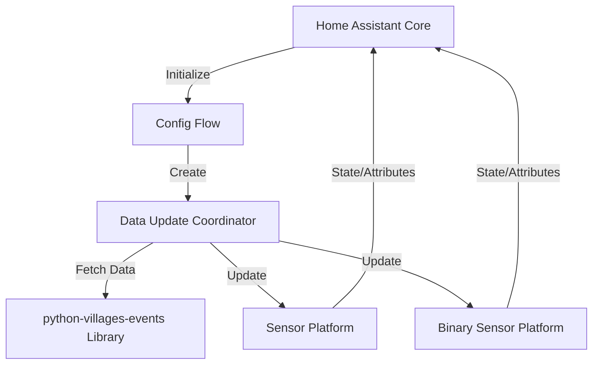

# Design Document: The Villages Events Home Assistant Integration

## Overview

This integration provides Home Assistant users with access to entertainment event information from The Villages, Florida. It creates sensor entities for each venue showing today's and tomorrow's events, along with binary sensors for tracking favorite performers. The integration leverages the existing `python-villages-events` library for data retrieval and follows Home Assistant's best practices for custom integrations.

### Key Features
- Per-venue sensor entities for today and tomorrow's events
- Favorite performer tracking with binary sensors
- HACS-compatible installation and updates
- UI-based configuration flow
- Automatic dependency management via Renovate
- Comprehensive error handling and recovery

## Architecture

### Component Overview



### Directory Structure

```
custom_components/villages_events/
├── __init__.py              # Integration setup and coordinator
├── manifest.json            # Integration metadata
├── config_flow.py           # UI configuration flow
├── const.py                 # Constants and configuration keys
├── coordinator.py           # Data update coordinator
├── sensor.py                # Venue event sensors
├── binary_sensor.py         # Favorite performer sensors
├── strings.json             # UI strings and translations
└── translations/
    └── en.json              # English translations

Repository Root:
├── custom_components/       # Integration code
├── .github/
│   └── workflows/          # CI/CD workflows (optional)
├── hacs.json               # HACS metadata
├── renovate.json           # Renovate configuration
├── README.md               # User documentation
├── DEVELOPER.md            # Developer documentation
├── LICENSE                 # License file
└── info.md                 # HACS info display
```

## Components and Interfaces

### 1. Integration Entry Point (`__init__.py`)

**Purpose**: Manages integration lifecycle and coordinator setup

**Key Functions**:
- `async_setup_entry(hass, entry)`: Initialize the integration
- `async_unload_entry(hass, entry)`: Clean up on removal
- `async_reload_entry(hass, entry)`: Handle configuration updates

**Responsibilities**:
- Create and register the DataUpdateCoordinator
- Forward setup to sensor and binary_sensor platforms
- Handle integration reload and unload

### 2. Configuration Flow (`config_flow.py`)

**Purpose**: Provide UI-based configuration

**Configuration Options**:
- Update interval (default: 60 minutes)
- Favorite performers (comma-separated list, optional)

**Flow Steps**:
1. User initiates integration addition
2. Display configuration form with update interval and favorite performers
3. Validate inputs
4. Create config entry
5. Allow options flow for reconfiguration

**Validation**:
- Update interval: Must be between 15 and 1440 minutes
- Favorite performers: Optional, validated as comma-separated strings

### 3. Data Update Coordinator (`coordinator.py`)

**Purpose**: Centralize data fetching and distribution

**Class**: `VillagesEventsCoordinator(DataUpdateCoordinator)`

**Key Methods**:
```python
async def _async_update_data(self) -> dict:
    """Fetch data from python-villages-events library."""
    # Returns structured event data
```

**Data Structure**:
```python
{
    "venues": {
        "venue_name": {
            "today": [
                {
                    "performer": "Artist Name",
                    "start_time": datetime,
                    "end_time": datetime,
                    "event_type": "Live Music"
                }
            ],
            "tomorrow": [...]
        }
    },
    "favorite_today": bool,
    "favorite_tomorrow": bool,
    "favorite_events": {
        "today": [...],
        "tomorrow": [...]
    }
}
```

**Update Strategy**:
- Configurable update interval (default 60 minutes)
- Exponential backoff on failures (15min, 30min, 60min)
- Maximum 3 consecutive failures before marking unavailable

**Integration with python-villages-events**:
```python
from villages_events import VillagesEvents

client = VillagesEvents()
events = await hass.async_add_executor_job(client.get_events, start_date, end_date)
```

### 4. Sensor Platform (`sensor.py`)

**Purpose**: Create per-venue sensors for today and tomorrow

**Entity Class**: `VillagesEventSensor(CoordinatorEntity, SensorEntity)`

**Entity Naming**:
- Format: `sensor.villages_events_{venue_slug}_{period}`
- Example: `sensor.villages_events_spanish_springs_today`

**State Value**:
- Number of events scheduled
- "0" when no events
- "unavailable" on coordinator failure

**Attributes**:
```python
{
    "venue": "Spanish Springs Town Square",
    "period": "today",  # or "tomorrow"
    "events": [
        {
            "performer": "Artist Name",
            "start_time": "2025-11-14T19:00:00",
            "end_time": "2025-11-14T21:00:00",
            "event_type": "Live Music"
        }
    ],
    "last_updated": "2025-11-14T10:00:00"
}
```

**Device Class**: None (custom sensor)
**Unit of Measurement**: "events"

### 5. Binary Sensor Platform (`binary_sensor.py`)

**Purpose**: Track favorite performer appearances

**Entity Class**: `VillagesFavoritePerformerSensor(CoordinatorEntity, BinarySensorEntity)`

**Entities Created**:
- `binary_sensor.villages_events_favorite_today`
- `binary_sensor.villages_events_favorite_tomorrow`

**State**:
- `on`: One or more favorite performers are scheduled
- `off`: No favorite performers scheduled
- `unavailable`: Coordinator failure

**Attributes**:
```python
{
    "favorite_performers": ["Artist 1", "Artist 2"],
    "matching_events": [
        {
            "performer": "Artist 1",
            "venue": "Spanish Springs Town Square",
            "start_time": "2025-11-14T19:00:00",
            "end_time": "2025-11-14T21:00:00"
        }
    ],
    "count": 1
}
```

**Device Class**: `presence`

## Data Models

### Event Model

```python
@dataclass
class VillagesEvent:
    """Represents a single event from The Villages calendar."""
    performer: str
    venue: str
    start_time: datetime
    end_time: datetime
    event_type: str
    description: str | None = None
```

### Venue Model

```python
@dataclass
class Venue:
    """Represents a venue with its events."""
    name: str
    slug: str  # URL-safe identifier
    today_events: list[VillagesEvent]
    tomorrow_events: list[VillagesEvent]
```

### Configuration Model

```python
@dataclass
class VillagesEventsConfig:
    """Integration configuration."""
    update_interval: int  # minutes
    favorite_performers: list[str]
```

## Error Handling

### Error Categories and Responses

1. **Network Errors** (ConnectionError, TimeoutError)
   - Log warning with retry information
   - Maintain last known state
   - Retry with exponential backoff

2. **API Errors** (HTTP 4xx, 5xx)
   - Log error with status code
   - Mark entities unavailable after 3 failures
   - Resume on successful fetch

3. **Data Parsing Errors**
   - Log error with problematic data
   - Skip invalid events
   - Continue processing valid events

4. **Configuration Errors**
   - Display user-friendly error in config flow
   - Prevent integration setup with invalid config
   - Provide specific validation messages

### Retry Strategy

```python
BACKOFF_SCHEDULE = [
    timedelta(minutes=15),  # First retry
    timedelta(minutes=30),  # Second retry
    timedelta(minutes=60),  # Third retry
]
```

After 3 consecutive failures, entities marked unavailable until next successful update.

## Testing Strategy

### Unit Tests

**Coordinator Tests** (`test_coordinator.py`):
- Data fetching and parsing
- Error handling and retries
- Favorite performer matching
- Date/time calculations

**Sensor Tests** (`test_sensor.py`):
- Entity creation for each venue
- State and attribute updates
- Unavailable state handling

**Binary Sensor Tests** (`test_binary_sensor.py`):
- Favorite performer detection
- State transitions
- Attribute population

**Config Flow Tests** (`test_config_flow.py`):
- User input validation
- Options flow
- Error handling

### Integration Tests

**End-to-End Flow**:
1. Install integration via config flow
2. Verify coordinator fetches data
3. Verify sensors created for each venue
4. Verify binary sensors created for favorites
5. Simulate data update
6. Verify entity states update
7. Simulate error condition
8. Verify graceful degradation

### Mock Data

Use fixtures to simulate python-villages-events responses:
```python
MOCK_EVENTS = [
    {
        "performer": "Test Band",
        "venue": "Spanish Springs Town Square",
        "start_time": "2025-11-14T19:00:00",
        "end_time": "2025-11-14T21:00:00",
        "event_type": "Live Music"
    }
]
```

## HACS Integration

### hacs.json

```json
{
  "name": "The Villages Events",
  "content_in_root": false,
  "filename": "villages_events",
  "render_readme": true,
  "homeassistant": "2024.1.0"
}
```

### info.md

Provides HACS store description with:
- Feature overview
- Installation instructions
- Configuration guidance
- Dashboard card examples

### Version Management

- Use semantic versioning (MAJOR.MINOR.PATCH)
- Tag releases in Git
- HACS automatically detects new releases

## Renovate Configuration

### renovate.json

```json
{
  "extends": ["config:base"],
  "packageRules": [
    {
      "matchPackageNames": ["python-villages-events"],
      "groupName": "Villages Events Library"
    },
    {
      "matchManagers": ["pip_requirements"],
      "groupName": "Python Dependencies"
    }
  ],
  "schedule": ["every weekend"],
  "automerge": false
}
```

### Monitored Dependencies

- `python-villages-events`: The core library
- `homeassistant`: Minimum HA version compatibility
- Any additional Python dependencies

## Developer Documentation

### DEVELOPER.md Contents

1. **Architecture Overview**
   - Component interaction diagram
   - Data flow explanation
   - Key design decisions

2. **Development Setup**
   - Local development environment
   - Testing with Home Assistant dev container
   - Debugging techniques

3. **Adding New Features**
   - Adding new sensor types
   - Extending configuration options
   - Adding new event filters

4. **Code Style and Standards**
   - Follow Home Assistant style guide
   - Type hints required
   - Docstring format

5. **Common Modification Scenarios**
   - Adding a new venue filter
   - Changing update frequency logic
   - Adding new event attributes

### Code Documentation Standards

All classes and public methods must include docstrings:

```python
class VillagesEventsCoordinator(DataUpdateCoordinator):
    """Coordinator for fetching Villages Events data.
    
    This coordinator manages data updates from the python-villages-events
    library and distributes the data to sensor entities.
    
    Attributes:
        config: Integration configuration including update interval
        favorite_performers: List of performer names to track
    """
    
    async def _async_update_data(self) -> dict:
        """Fetch data from The Villages calendar.
        
        Returns:
            Dictionary containing venue events and favorite performer matches.
            
        Raises:
            UpdateFailed: When data fetch fails after retries.
        """
```

## Security Considerations

1. **No Authentication Required**: The Villages calendar is public data
2. **Input Validation**: All user inputs validated in config flow
3. **No Sensitive Data**: No personal information stored
4. **Rate Limiting**: Respect source website rate limits
5. **Error Messages**: Don't expose internal paths or sensitive info

## Performance Considerations

1. **Update Frequency**: Default 60 minutes to minimize API calls
2. **Async Operations**: All I/O operations use async/await
3. **Executor for Sync Library**: python-villages-events runs in executor
4. **Efficient Data Structure**: Minimize memory footprint
5. **Entity Count**: Dynamic based on venues (estimated 5-10 venues)

## Future Extensibility

The design supports future enhancements:

1. **Event Type Filtering**: Add config option to filter by event type
2. **Date Range Expansion**: Support viewing events beyond tomorrow
3. **Calendar Platform**: Integrate with HA calendar platform
4. **Notifications**: Built-in notification service for favorites
5. **Multiple Locations**: Support other Villages locations if API expands
