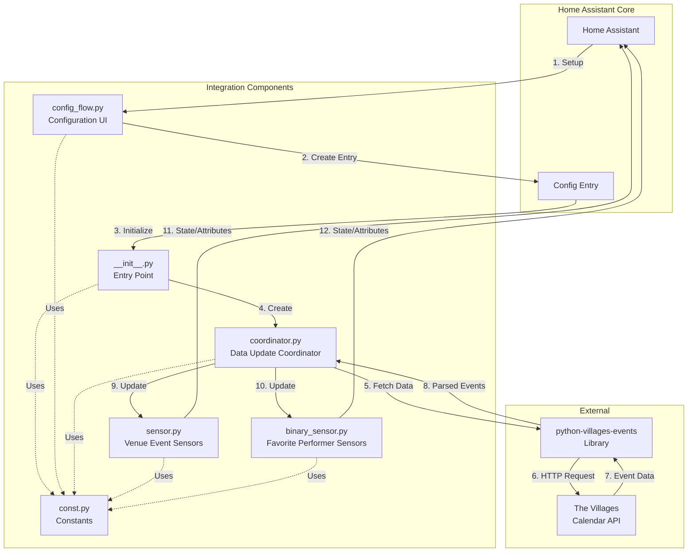

# Developer Documentation: The Villages Events Integration

## Table of Contents

1. [Architecture Overview](#architecture-overview)
2. [Data Flow](#data-flow)
3. [Development Setup](#development-setup)
4. [Component Details](#component-details)
5. [Adding New Features](#adding-new-features)
6. [Code Style Standards](#code-style-standards)
7. [Testing](#testing)
8. [Common Modification Scenarios](#common-modification-scenarios)

## Architecture Overview

The Villages Events integration follows Home Assistant's standard custom component architecture with a coordinator-based data update pattern. This design centralizes data fetching and distributes updates efficiently to multiple entities.

### Component Interaction Diagram



### Key Design Decisions

1. **Coordinator Pattern**: Centralizes data fetching to avoid redundant API calls
2. **Dynamic Entity Creation**: Sensors are created dynamically based on available venues
3. **Async/Await**: All I/O operations use async patterns for non-blocking execution
4. **Executor for Sync Library**: The synchronous `python-villages-events` library runs in an executor
5. **Graceful Degradation**: Entities maintain last known state during temporary failures

## Data Flow

### Initialization Flow

```
User adds integration
    ↓
ConfigFlow.async_step_user()
    ↓
Validate inputs (update interval, favorite performers)
    ↓
Create ConfigEntry
    ↓
async_setup_entry() in __init__.py
    ↓
Create VillagesEventsCoordinator
    ↓
async_config_entry_first_refresh()
    ↓
_async_update_data() fetches initial data
    ↓
Store coordinator in hass.data[DOMAIN]
    ↓
Forward setup to sensor and binary_sensor platforms
    ↓
Platforms create entities
    ↓
Entities register with Home Assistant
```

### Data Update Flow

```
Coordinator timer triggers
    ↓
_async_update_data() called
    ↓
Calculate today/tomorrow dates
    ↓
Call python-villages-events in executor
    ↓
Parse and structure event data by venue
    ↓
Match favorite performers
    ↓
Return structured data dictionary
    ↓
Coordinator notifies all entities
    ↓
Entities update state and attributes
    ↓
Home Assistant UI reflects changes
```

### Data Structure

The coordinator returns data in this structure:

```python
{
    "venues": {
        "Spanish Springs Town Square": {
            "today": [
                {
                    "performer": "Artist Name",
                    "start_time": datetime,
                    "end_time": datetime,
                    "event_type": "Live Music"
                }
            ],
            "tomorrow": [...]
        },
        "Lake Sumter Landing": {...}
    },
    "favorite_today": bool,
    "favorite_tomorrow": bool,
    "favorite_events": {
        "today": [
            {
                "performer": "Favorite Artist",
                "venue": "Spanish Springs Town Square",
                "start_time": datetime,
                "end_time": datetime,
                "event_type": "Live Music"
            }
        ],
        "tomorrow": [...]
    }
}
```

## Development Setup

### Prerequisites

- Python 3.11 or higher
- Home Assistant development environment
- Git

### Local Development Environment

1. **Clone the repository**:
```bash
git clone https://github.com/yourusername/villages-events-hacs.git
cd villages-events-hacs
```

2. **Set up Home Assistant development container** (recommended):
```bash
# Using the official Home Assistant devcontainer
# Open in VS Code with Dev Containers extension
```

3. **Or set up manual development environment**:
```bash
# Create virtual environment
python -m venv venv
source venv/bin/activate  # On Windows: venv\Scripts\activate

# Install Home Assistant
pip install homeassistant

# Install dependencies
pip install python-villages-events
```

4. **Link integration to Home Assistant config**:
```bash
# Create symbolic link in your HA config directory
ln -s $(pwd)/custom_components/villages_events ~/.homeassistant/custom_components/villages_events
```

5. **Restart Home Assistant**:
```bash
hass -c ~/.homeassistant
```

### Testing with Home Assistant

1. Navigate to Settings → Devices & Services
2. Click "Add Integration"
3. Search for "The Villages Events"
4. Follow configuration flow
5. Check Developer Tools → States to see created entities

### Debugging

Enable debug logging in `configuration.yaml`:

```yaml
logger:
  default: info
  logs:
    custom_components.villages_events: debug
```

View logs in real-time:
```bash
tail -f ~/.homeassistant/home-assistant.log | grep villages_events
```

## Component Details

### __init__.py - Integration Entry Point

**Purpose**: Manages integration lifecycle

**Key Functions**:

- `async_setup_entry(hass, entry)`: Initializes the integration
  - Creates coordinator
  - Performs initial data fetch
  - Stores coordinator in `hass.data`
  - Forwards setup to platforms

- `async_unload_entry(hass, entry)`: Cleans up on removal
  - Unloads platforms
  - Removes coordinator from `hass.data`

- `async_reload_entry(hass, entry)`: Handles configuration updates
  - Unloads existing entry
  - Sets up entry with new configuration

### config_flow.py - Configuration UI

**Purpose**: Provides UI-based configuration

**Classes**:

- `VillagesEventsConfigFlow`: Handles initial setup
  - `async_step_user()`: Displays configuration form
  - Validates update interval (15-1440 minutes)
  - Parses comma-separated favorite performers

- `VillagesEventsOptionsFlow`: Handles reconfiguration
  - `async_step_init()`: Displays options form
  - Updates existing configuration

**Validation Rules**:
- Update interval must be integer between 15 and 1440
- Favorite performers are optional, comma-separated strings

### coordinator.py - Data Update Coordinator

**Purpose**: Centralizes data fetching and distribution

**Class**: `VillagesEventsCoordinator(DataUpdateCoordinator)`

**Key Methods**:

- `__init__(hass, config_entry)`: Initializes coordinator
  - Extracts configuration
  - Converts favorite performers to lowercase for matching
  - Sets update interval

- `_async_update_data()`: Fetches data from API
  - Calculates today/tomorrow dates
  - Calls `python-villages-events` in executor
  - Structures data by venue and period
  - Matches favorite performers
  - Implements error handling and retry logic

- `_match_favorite_performers(venues_data)`: Matches events against favorites
  - Case-insensitive matching
  - Returns favorite flags and matching events

**Error Handling**:
- Network errors: Exponential backoff (15, 30, 60 minutes)
- Max 3 consecutive failures before marking unavailable
- Maintains last known state during failures

### sensor.py - Venue Event Sensors

**Purpose**: Creates per-venue sensors for today and tomorrow

**Class**: `VillagesEventSensor(CoordinatorEntity, SensorEntity)`

**Entity Naming**: `sensor.villages_events_{venue_slug}_{period}`

**State**: Number of events scheduled (integer)

**Attributes**:
- `venue`: Venue name
- `period`: "today" or "tomorrow"
- `events`: List of event dictionaries
- `last_updated`: ISO timestamp

**Key Methods**:

- `_create_slug(name)`: Converts venue name to URL-safe slug
- `native_value`: Returns event count
- `extra_state_attributes`: Returns detailed event information

### binary_sensor.py - Favorite Performer Sensors

**Purpose**: Tracks favorite performer appearances

**Class**: `VillagesFavoritePerformerSensor(CoordinatorEntity, BinarySensorEntity)`

**Entities**:
- `binary_sensor.villages_events_favorite_today`
- `binary_sensor.villages_events_favorite_tomorrow`

**State**: `on` if favorite performers scheduled, `off` otherwise

**Attributes**:
- `favorite_performers`: List of configured favorites
- `matching_events`: List of matching event dictionaries
- `count`: Number of matching events

**Device Class**: `presence`

### const.py - Constants

**Purpose**: Centralizes all constants and configuration keys

**Categories**:
- Domain and platform identifiers
- Configuration keys and defaults
- Update interval constraints
- Retry configuration
- Entity naming patterns
- Attribute keys
- Units of measurement

## Adding New Features

### Adding a New Sensor Type

Example: Adding a sensor for events by event type

1. **Define constants** in `const.py`:
```python
CONF_EVENT_TYPE_FILTER = "event_type_filter"
DEFAULT_EVENT_TYPE_FILTER = []
```

2. **Update config flow** in `config_flow.py`:
```python
# In data_schema
vol.Optional(
    CONF_EVENT_TYPE_FILTER,
    default="",
): str,
```

3. **Update coordinator** in `coordinator.py`:
```python
# In __init__
self.event_type_filter = config_entry.data.get(
    CONF_EVENT_TYPE_FILTER, DEFAULT_EVENT_TYPE_FILTER
)

# In _async_update_data, add filtering logic
if self.event_type_filter:
    events = [e for e in events if e["event_type"] in self.event_type_filter]
```

4. **Create new sensor class** in `sensor.py` or new file:
```python
class VillagesEventTypeSensor(CoordinatorEntity, SensorEntity):
    """Sensor for events filtered by type."""
    
    def __init__(self, coordinator, event_type):
        super().__init__(coordinator)
        self.event_type = event_type
        # ... rest of implementation
```

5. **Register in platform setup**:
```python
# In async_setup_entry
for event_type in coordinator.event_type_filter:
    entities.append(VillagesEventTypeSensor(coordinator, event_type))
```

### Extending Configuration Options

Example: Adding a date range option

1. **Add constant**:
```python
CONF_DATE_RANGE = "date_range"
DEFAULT_DATE_RANGE = 2  # days
```

2. **Update config flow validation**:
```python
date_range = user_input.get(CONF_DATE_RANGE, DEFAULT_DATE_RANGE)
if not isinstance(date_range, int) or not (1 <= date_range <= 7):
    errors[CONF_DATE_RANGE] = "invalid_date_range"
```

3. **Update coordinator logic**:
```python
# Calculate end date based on range
end_date = today + timedelta(days=self.date_range)

# Fetch events for extended range
events = await self.hass.async_add_executor_job(
    client.get_events,
    today,
    end_date,
)
```

4. **Update strings.json**:
```json
{
  "config": {
    "step": {
      "user": {
        "data": {
          "date_range": "Number of days to fetch (1-7)"
        }
      }
    }
  }
}
```

### Adding Event Filtering

Example: Filter by time of day

1. **Add filter method to coordinator**:
```python
def _filter_by_time(self, events, start_hour, end_hour):
    """Filter events by time of day."""
    filtered = []
    for event in events:
        event_hour = event["start_time"].hour
        if start_hour <= event_hour < end_hour:
            filtered.append(event)
    return filtered
```

2. **Apply filter in _async_update_data**:
```python
# After fetching events
if self.time_filter_enabled:
    events = self._filter_by_time(
        events,
        self.filter_start_hour,
        self.filter_end_hour
    )
```

## Code Style Standards

### General Guidelines

- Follow [PEP 8](https://pep8.org/) style guide
- Use [Black](https://black.readthedocs.io/) for code formatting
- Follow [Home Assistant's style guide](https://developers.home-assistant.io/docs/development_guidelines)
- Maximum line length: 88 characters (Black default)

### Type Hints

All functions must include type hints:

```python
def process_event(event: dict[str, Any]) -> dict[str, str]:
    """Process event data."""
    return {"name": event["performer"]}
```

### Docstrings

Use Google-style docstrings for all classes and public methods:

```python
def calculate_date_range(start: date, days: int) -> tuple[date, date]:
    """Calculate date range from start date.
    
    Args:
        start: Starting date
        days: Number of days in range
        
    Returns:
        Tuple of (start_date, end_date)
        
    Raises:
        ValueError: If days is less than 1
    """
    if days < 1:
        raise ValueError("Days must be at least 1")
    return start, start + timedelta(days=days)
```

### Logging

Use appropriate log levels:

```python
_LOGGER.debug("Detailed information for debugging")
_LOGGER.info("General informational messages")
_LOGGER.warning("Warning messages for recoverable issues")
_LOGGER.error("Error messages for failures")
```

### Imports

Organize imports in this order:

1. Standard library imports
2. Third-party imports
3. Home Assistant imports
4. Local imports

```python
from __future__ import annotations

from datetime import datetime, timedelta
import logging

from homeassistant.core import HomeAssistant
from homeassistant.helpers.update_coordinator import DataUpdateCoordinator

from .const import DOMAIN
```

### Constants

- Use UPPER_CASE for constants
- Group related constants together
- Add comments for non-obvious values

```python
# Update interval constraints (in minutes)
MIN_UPDATE_INTERVAL = 15
MAX_UPDATE_INTERVAL = 1440  # 24 hours
DEFAULT_UPDATE_INTERVAL = 60
```

## Testing

### Unit Testing

Create tests in `tests/` directory:

```python
"""Tests for The Villages Events coordinator."""
import pytest
from homeassistant.core import HomeAssistant

from custom_components.villages_events.coordinator import VillagesEventsCoordinator


async def test_coordinator_update(hass: HomeAssistant, mock_config_entry):
    """Test coordinator data update."""
    coordinator = VillagesEventsCoordinator(hass, mock_config_entry)
    
    await coordinator.async_refresh()
    
    assert coordinator.data is not None
    assert "venues" in coordinator.data
```

### Integration Testing

Test with actual Home Assistant instance:

1. Set up test configuration
2. Add integration through UI
3. Verify entities are created
4. Check entity states and attributes
5. Test configuration updates
6. Test error scenarios

### Manual Testing Checklist

- [ ] Integration installs via HACS
- [ ] Configuration flow accepts valid inputs
- [ ] Configuration flow rejects invalid inputs
- [ ] Entities are created for all venues
- [ ] Entity states update correctly
- [ ] Favorite performer matching works
- [ ] Error handling maintains last state
- [ ] Configuration updates trigger reload
- [ ] Integration unloads cleanly

## Common Modification Scenarios

### Scenario 1: Adding a New Venue Filter

**Goal**: Allow users to select specific venues to track

**Steps**:

1. Add configuration option in `const.py`:
```python
CONF_SELECTED_VENUES = "selected_venues"
DEFAULT_SELECTED_VENUES = []  # Empty means all venues
```

2. Update config flow to show venue selection:
```python
# In async_step_user, after fetching available venues
vol.Optional(
    CONF_SELECTED_VENUES,
    default=[],
): cv.multi_select({venue: venue for venue in available_venues}),
```

3. Filter venues in sensor platform setup:
```python
# In async_setup_entry
selected_venues = coordinator.config_entry.data.get(
    CONF_SELECTED_VENUES, []
)

for venue_name in venues_data.keys():
    # Skip if venues are filtered and this isn't selected
    if selected_venues and venue_name not in selected_venues:
        continue
    
    entities.append(VillagesEventSensor(...))
```

### Scenario 2: Changing Update Frequency Logic

**Goal**: Use different update intervals for different times of day

**Steps**:

1. Add time-based configuration:
```python
CONF_PEAK_HOURS_INTERVAL = "peak_hours_interval"
CONF_OFF_PEAK_INTERVAL = "off_peak_interval"
CONF_PEAK_START_HOUR = "peak_start_hour"
CONF_PEAK_END_HOUR = "peak_end_hour"
```

2. Implement dynamic interval in coordinator:
```python
def _get_update_interval(self) -> timedelta:
    """Calculate update interval based on time of day."""
    now = dt_util.now()
    current_hour = now.hour
    
    if self.peak_start_hour <= current_hour < self.peak_end_hour:
        return timedelta(minutes=self.peak_hours_interval)
    return timedelta(minutes=self.off_peak_interval)

# In _async_update_data, after successful update
self.update_interval = self._get_update_interval()
```

### Scenario 3: Adding New Event Attributes

**Goal**: Expose additional event information (e.g., ticket price, venue capacity)

**Steps**:

1. Update event dictionary structure in coordinator:
```python
event_dict = {
    "performer": event.get("performer"),
    "start_time": event.get("start_time"),
    "end_time": event.get("end_time"),
    "event_type": event.get("event_type"),
    "price": event.get("price", "Free"),  # New attribute
    "capacity": event.get("capacity"),     # New attribute
}
```

2. Add constants for new attributes:
```python
ATTR_PRICE = "price"
ATTR_CAPACITY = "capacity"
```

3. Include in sensor attributes:
```python
formatted_event = {
    "performer": event.get("performer"),
    "start_time": ...,
    "end_time": ...,
    "event_type": event.get("event_type"),
    "price": event.get("price", "Free"),
    "capacity": event.get("capacity"),
}
```

### Scenario 4: Adding Notification Support

**Goal**: Send notifications when favorite performers are scheduled

**Steps**:

1. Create notification service in new file `notify.py`:
```python
async def async_send_favorite_notification(
    hass: HomeAssistant,
    performer: str,
    venue: str,
    start_time: datetime,
) -> None:
    """Send notification for favorite performer."""
    message = f"{performer} is playing at {venue} at {start_time}"
    
    await hass.services.async_call(
        "notify",
        "notify",
        {"message": message, "title": "Favorite Performer Alert"},
    )
```

2. Call from coordinator when favorites detected:
```python
# In _async_update_data, after matching favorites
if result["favorite_today"] and not self.last_data.get("favorite_today"):
    # New favorite detected
    for event in result["favorite_events"]["today"]:
        await async_send_favorite_notification(
            self.hass,
            event["performer"],
            event["venue"],
            event["start_time"],
        )
```

---

## Versioning

This project follows [Semantic Versioning](https://semver.org/spec/v2.0.0.html):

- **MAJOR** version for incompatible API changes
- **MINOR** version for new functionality in a backward compatible manner
- **PATCH** version for backward compatible bug fixes

### Version Management

The version is maintained in three places and must be kept in sync:

1. **`custom_components/villages_events/__version__.py`**: Python version constant
2. **`custom_components/villages_events/manifest.json`**: Home Assistant manifest version
3. **`CHANGELOG.md`**: Version history and release notes

### Releasing a New Version

1. **Update version numbers**:
```bash
# Update __version__.py
echo '__version__ = "0.2.0"' > custom_components/villages_events/__version__.py

# Update manifest.json
# Change "version": "0.2.0"
```

2. **Update CHANGELOG.md**:
```markdown
## [0.2.0] - 2025-02-15

### Added
- New feature description

### Changed
- Modified behavior description

### Fixed
- Bug fix description
```

3. **Commit and tag**:
```bash
git add .
git commit -m "Release version 0.2.0"
git tag -a v0.2.0 -m "Version 0.2.0"
git push origin main --tags
```

4. **Create GitHub release**:
- Go to GitHub repository
- Click "Releases" → "Create a new release"
- Select the tag (v0.2.0)
- Copy changelog content for release notes
- Attach release assets if needed
- Publish release

### Version Checking in Code

Access the version programmatically:

```python
from custom_components.villages_events import __version__

_LOGGER.info("The Villages Events integration version %s", __version__)
```

## Additional Resources

- [Home Assistant Developer Docs](https://developers.home-assistant.io/)
- [python-villages-events Library](https://github.com/yourusername/python-villages-events)
- [HACS Documentation](https://hacs.xyz/)
- [Home Assistant Architecture](https://developers.home-assistant.io/docs/architecture_index)
- [Semantic Versioning](https://semver.org/)
- [Keep a Changelog](https://keepachangelog.com/)

## Contributing

When contributing to this integration:

1. Fork the repository
2. Create a feature branch
3. Make your changes following the style guide
4. Add tests for new functionality
5. Update documentation
6. Update CHANGELOG.md with your changes
7. Submit a pull request

## Support

For issues and questions:
- GitHub Issues: [Project Issues](https://github.com/yourusername/villages-events-hacs/issues)
- Home Assistant Community: [Community Forum](https://community.home-assistant.io/)
